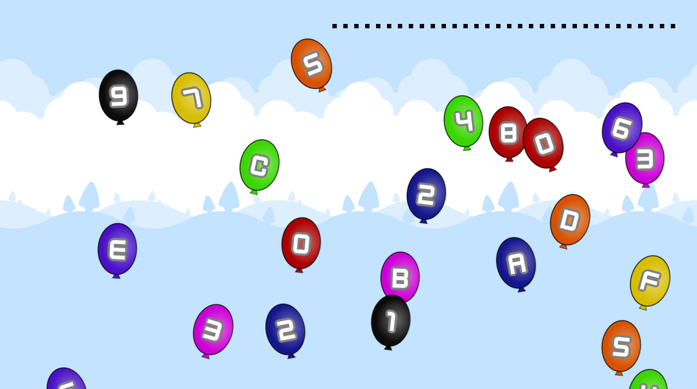
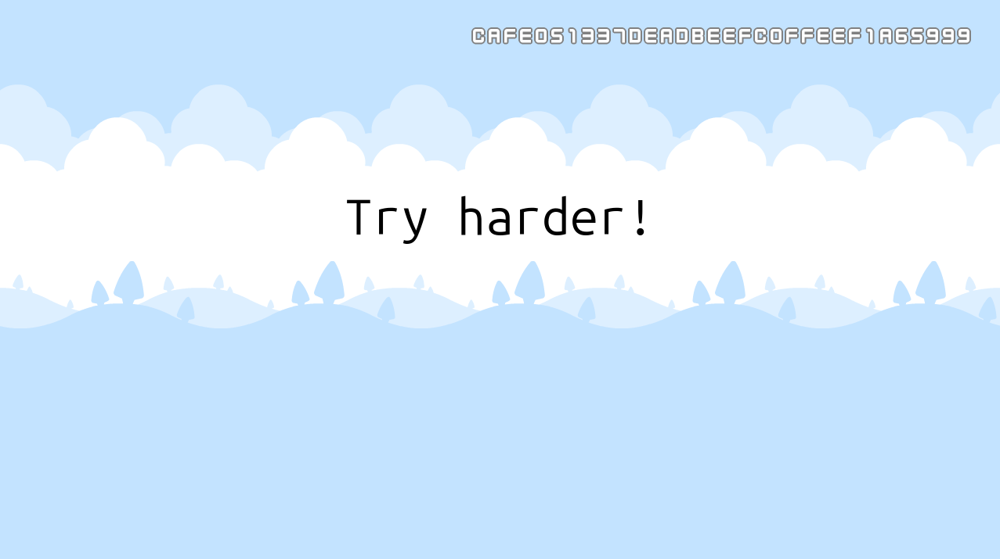

# Cafe Latte
This challenge contains a game that I made for the Nintendo Wii U.

### Challenge Name

The challenge name comes from the fact that various parts of the Wii U have coffee-related codenames, such as:

| Name | Part |
| --- | --- |
| Cafe OS | The main operating system of the Wii U |
| Espresso | The main PowerPC CPU of the Wii U |
| Latte | The graphics processing unit of the Wii U |
| Starbuck | The ARM-based security processor of the Wii U |
| Barista | The Wii U menu software |

### Game Design
Pop balloons by tapping on them. If you pop the balloons in the correct order, the flag will appear. If not, try harder...

The assets for this game were taken from [here](https://kenney.nl) and [here](https://roastedcodestudio.itch.io/balloon-pop-asset).

### Emulation
The game has been tested and was confirmed to work on a real Wii U with [Aroma](https://aroma.foryour.cafe).

Because neither [decaf-emu](https://github.com/decaf-emu/decaf-emu) nor [Cemu](https://cemu.info) supports a particular feature that is used by the flag verification algorithm, you will not see the try harder message or flag if you run this game in an emulator. This means that you will likely need to resort to static analysis or implement the missing emulation part yourself.

**Note:** even on real hardware, no debugging tools are available for the component that executes the flag verification algorithm.
